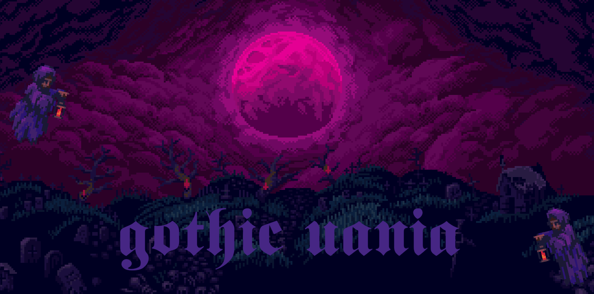

# _GOTHIC VANIA_

- **Description :**

  Gothic Vania is an exciting Unity game that blends elements from the beloved Castlevania and Metroid series. In this thrilling adventure, players embark on a journey through a dark and mysterious world filled with intricate levels, challenging enemies, and hidden secrets. With stunning visuals, immersive gameplay mechanics, and a haunting soundtrack, Gothic Vania promises to deliver an unforgettable gaming experience reminiscent of the classic titles it draws inspiration from.

---

- **Controls :**

  - **Right : `D / →`**
  - **Left : `A / ←`**
  - **Jump : `W / Space`**
  - **Attack : `J / →`**
  - **Crouch : `Left Control`**

---

- **Stack :**

  - **Gothic Vania : `1.1`**
  - **Unity : `2021.3.19f1`**

---

- **Credits :**

  - **Author : [FANTAS666X](https://github.com/FANTAS666IXI)**
  - **Visual Art : Ansimuz & SlowDevelopment**
  - **Audio : ALKAKRAB, ryusa, Davidsraba, ethanchase7744, cribbler, Loyalty_Freak_Music, Jamius, Flying_Deer_Fx, HorrorAudio, PearceWilsonKing, bevibeldesign, ThePig 01, InspectorJ, Dymewiz**
